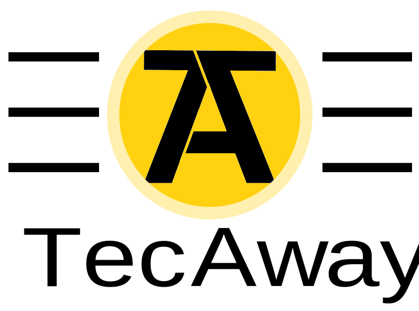

# TecAway Frontend



TecAway es una aplicación web desarrollada para facilitar la conexión entre técnicos/as de teatro y quienes buscan profesionales para sus producciones. Los técnicos/as pueden crear un perfil con una descripción de sus conocimientos y habilidades, permitiendo a los productores o coordinadores encontrar fácilmente al personal que necesitan.

## Características Principales

- Gestión de perfiles de técnicos/as con detalles personalizados.
- Filtrado dinámico y búsqueda avanzada por conocimientos específicos.
- Contacto directo entre técnicos/as y productores.
- Interfaz responsiva diseñada con SCSS y Bootstrap modificada a partir de una plantilla de Bootswatch.

## Tecnologías Utilizadas

- **Framework principal:** Angular 19
- **Estilos:** Bootstrap, SCSS, y una plantilla personalizada de Bootswatch
- **Versionado:** Git

## Estructura del Proyecto

```
src
├── app
│   ├── app.component.*          # Configuración principal
│   ├── components               # Componentes de la aplicación
│   │   ├── add-knowledges       # Gestión de conocimientos
│   │   ├── edit-user            # Edición de perfiles
│   │   ├── footer               # Pie de página
│   │   ├── header               # Encabezado
│   │   ├── home                 # Página principal
│   │   ├── login                # Inicio de sesión
│   │   ├── register             # Registro de usuarios
│   │   ├── technician-detail    # Detalle de técnicos/as
│   │   ├── technicians          # Listado de técnicos/as
│   │   └── user-info            # Información del usuario
│   ├── guards                   # Protección de rutas
│   ├── interceptors             # Interceptores HTTP
│   ├── interfaces               # Interfaces de datos
│   ├── services                 # Servicios para el manejo de datos
│   └── validators               # Validaciones personalizadas
├── assets
│   └── img                      # Imágenes y recursos visuales
├── environments                 # Configuración por entorno
├── index.html                   # Entrada principal
├── main.ts                      # Punto de inicio de la aplicación
└── styles.scss                  # Estilos globales
```

## Instalación y Uso

1. Clona el repositorio:
   ```bash
   git clone https://github.com/mcallejo-10/TecAway-Frontend.git
   ```

2. Accede al directorio del proyecto:
   ```bash
   cd TecAway-Frontend
   ```

3. Instala las dependencias:
   ```bash
   npm install
   ```

4. Inicia el servidor de desarrollo:
   ```bash
   ng serve
   ```

5. Abre [http://localhost:4200](http://localhost:4200) en tu navegador para ver la aplicación en ejecución.

## Contribución

Si deseas contribuir a TecAway, sigue estos pasos:

1. Crea un fork del repositorio.
2. Crea una rama para tu funcionalidad o corrección:
   ```bash
   git checkout -b mi-rama
   ```
3. Realiza tus cambios y confirma los commits:
   ```bash
   git commit -m "Descripción de los cambios"
   ```
4. Envía tus cambios:
   ```bash
   git push origin mi-rama
   ```
5. Abre un pull request en el repositorio original.

## Licencia

Este proyecto está bajo la licencia MIT. Consulta el archivo `LICENSE` para más detalles.

---

Para más información o soporte, contacta al equipo a través del repositorio oficial: [TecAway Frontend](https://github.com/mcallejo-10/TecAway-Frontend.git).

 
